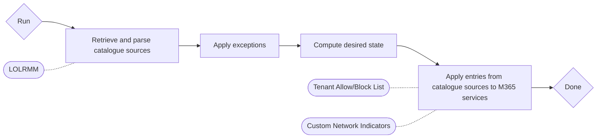

# PreventKit

PreventKit manages blocking rules for frequently abused services in one Microsoft 365 tenant. It converts curated 'living off the land' lists into block rules for Microsoft 365 services. It aims to be as non-intrusive as possible, while providing preventive measures in your Microsoft 365 tenant in functionality you're already paying for.

## How it works

A **Run** retrieves each enabled **catalogue source**, parses it with a **source adapter** into the canonical **Service** and **Blockable Address** model, validates the result, and computes the **desired state** as the union of all valid catalogue entries. The desired state is then reconciled to the **enforcement destinations** that were supplied with a capacity: managed entries that are no longer desired are removed, and missing managed entries are added. Administrator-owned entries are never adopted or changed.

Every Run is either a manual invocation or a scheduled invocation; both drive the same engine.

A simple, visual flowchart of the process:



## Catalogue sources

A **catalogue declaration** enables a block catalogue and sets its scope. Declarations live in `catalogues/`:

- `lolrmm.catalog.psd1` — the lolrmm.io RMM domains CSV (`LolRmmCsv` adapter).

> [!NOTE]
> Other catalogues will be added in the future.

A catalogue source that fails retrieval or validation is skipped in favour of its **last known good snapshot** when one exists; otherwise the Run still completes and records the failure.

## Exceptions

Exceptions are non-overriding: matched entries leave the desired state and are never enforced. No allow rule is ever created.

- **Global exceptions** are stored, version-controlled declarations in an exception directory (`*.exception.psd1`). Every enabled declaration contributes its exception keys to every Run. Removing or disabling a declaration restores enforcement on the next Run.
- **Invocation exceptions** are supplied through the Run's parameters and remain effective only while supplied to every Run.

Both match by **exception key**, such as `service:lolrmm/AnyDesk` or `domain:anydesk.com`.

## Running

A manual Run over the repository catalogues:

```powershell
Import-Module ./src/PreventKit/PreventKit.psd1
Invoke-PreventKitRun -CatalogueDirectory ./catalogues -StateDirectory ./state -LogDirectory ./logs
```

A **WhatIf run** computes and reports the desired state without modifying any enforcement destination:

```powershell
Invoke-PreventKitRun -CatalogueDirectory ./catalogues -WhatIf
```

Apply global exceptions from a directory and reconcile the Tenant Allow/Block List and Custom Network Indicators:

```powershell
Invoke-PreventKitRun -CatalogueDirectory ./catalogues -ExceptionDirectory ./exceptions `
  -StateDirectory ./state -LogDirectory ./logs `
  -TablCapacity 5000 -CniCapacity 15000
```

A **CNI Run authenticates** with a caller-supplied token. Acquire it first (see
[Authentication](docs/authentication.md)) and pass it as `-CniToken`; a Run that
reconciles Custom Network Indicators without a token fails before any request:

```powershell
$token = (az account get-access-token --resource 'https://api.securitycenter.microsoft.com' | ConvertFrom-Json).accessToken
Invoke-PreventKitRun -CatalogueDirectory ./catalogues -CniCapacity 15000 -CniToken $token
```

## Capacity limits

Enforcement destinations impose license-dependent entry limits. Choose the `-*Capacity` parameters to fit both the planned managed-entry count and your tenant's limits; the **capacity preflight** aborts a destination when the planned count would exceed the supplied capacity.

| Destination | License | Block entry limit |
| --- | --- | --- |
| **CNI** — Custom Network Indicators | Defender for Endpoint | 15,000 indicators per tenant |

| Destination | License | Block entry limit |
| --- | --- | --- |
| **TABL** — Tenant Allow/Block List | M365 without Defender for Office 365 | 500 |
| **TABL** — Tenant Allow/Block List | Defender for Office 365 Plan 1 (BP, E3) | 1,000 |
| **TABL** — Tenant Allow/Block List | Defender for Office 365 Plan 2 (E5, E7) | 10,000 |

## Scheduled runs

`scheduled/Start-PreventKitScheduledRun.ps1` runs a Run unattended and returns a process exit code a scheduler can observe (0 on success, 1 on failure). Outcomes land in the run log, including a `Failed` entry with the error message for failing Runs. A scheduled CNI Run supplies its token the same way a manual one does — pass it as `-CniToken` when invoking the wrapper:

```powershell
$token = (az account get-access-token --resource 'https://api.securitycenter.microsoft.com' | ConvertFrom-Json).accessToken
& pwsh -NoProfile -File ./scheduled/Start-PreventKitScheduledRun.ps1 `
  -CatalogueDirectory ./catalogues -StateDirectory ./state -LogDirectory ./logs `
  -CniCapacity 15000 -CniToken $token
```

See the script's comment-based help for Windows Task Scheduler registration.

## Run log

Each Run writes a durable entry to the log directory (`<run-id>.run.json`) capturing source fingerprints, exceptions applied, per-destination reconciliation outcomes, and the Run status. Query entries with `Get-PreventKitRunLog` and print a per-run report with `New-PreventKitRunReport`. A Run that throws during reconciliation is logged as `Failed` with its error message and any captured per-destination outcomes; a Run whose destination aborts (for example a capacity preflight failure) is logged as `Partial` while still recording the `Aborted` destination outcome.

## Module layout

- `src/PreventKit/Public/` — the exported commands (`Invoke-PreventKitRun`, `Start-PreventKitRun`, `Get-PreventKitRunLog`, `New-PreventKitRunReport`).
- `src/PreventKit/Private/` — the retrieval, parsing, validation, exception, projection, reconciliation, and run-log internals.
- `catalogues/` — the version-controlled catalogue declarations.
- `scheduled/` — the scheduled Run entry point.
- `docs/authentication.md` — Microsoft Entra app registration and CNI token acquisition (interactive, client certificate, managed identity).
- `tests/` — Pester tests and fixtures.

## Development

Run the test suite with Pester 5:

```powershell
Invoke-Pester -Path ./tests
```
